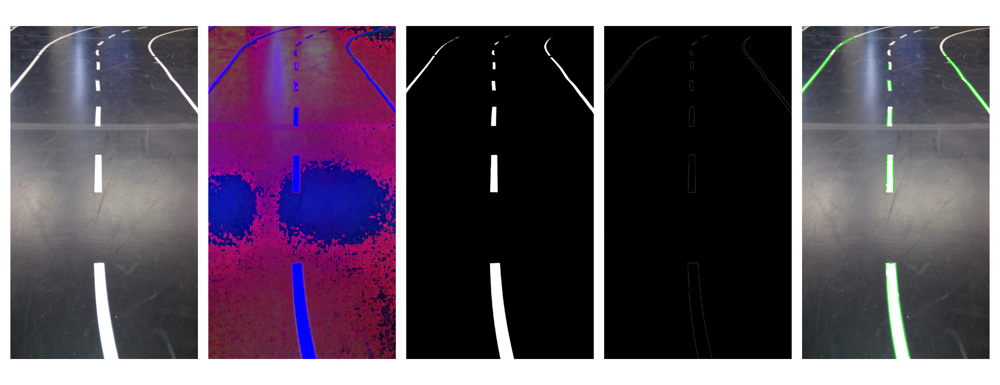

### Autonomous Driving Android Car 
developed by [B. Grau](https://github.com/SuperCrazyKing) and [D. Lagamtzis](https://github.com/umadbro96) (since 2018)


---

# Agenda

* Intro
* Stand der Technik
* Implementierung
* Prototyp
* Beispiele
* Fazit

---

# Intro 

Android-App zur selbstständigen Steuerung  eines Modellautos durch eine Teststrecke 

* Proof of Concept : mit dem Smartphone geht MachineVision in Real-Time
* Auseinandersetzung mit OpenCV

---

# Stand der Technik

* OpenCV 
* Kommunikation - Bluetooth / USB OTG
* Arduino als Blackbox


---

# Implementierung
* Pipeline
   - [RGB2HSV](https://docs.opencv.org/3.1.0/de/d25/imgproc_color_conversions.html)
   - [Arithmetic Operation](https://docs.opencv.org/3.4/d0/d86/tutorial_py_image_arithmetics.html) (bitwise_and)
   - [Mat2Gray](https://docs.opencv.org/3.1.0/de/d25/imgproc_color_conversions.html)
   - [Canny Edge Detector](https://docs.opencv.org/3.1.0/da/d5c/tutorial_canny_detector.html)
   - [Hough Linien Transformation](https://docs.opencv.org/3.1.0/d9/db0/tutorial_hough_lines.html) 
* `Display` der Linien auf Originalbild

+++

## Beispiel an einem Bild eines Streckenteils




+++

* Entscheidungsprozess
   - Durchschnittswinkel als gefundenen Winkel berechen -> Lenkrichtung bestimmen
      ```java
         private int getSteeringAngle(List<Double> angles) {
            double sum = 0;
            for(Double angle in angles) {
               sum += angle;
            }
            double avg = sum / angles.size();
            return (int)avg;
         }
      ```
   
---

# Prototyp

### Live Demo !


##### Source : neuronsw.com

---

# Beispiele
   - [>>Hier<<](https://github.com/umadbro96/androidAICar/tree/master/aiopencv/app/src/main/java/stud/edu/aiopencv) kann direkt in den Code gesprungen werden
   
   - [>>Hier<<](https://github.com/umadbro96/androidAICar/tree/master/assets) lassen sich die aufgenommenen Medien finden 
   

---
# Fazit

* [X] Mustererkennung auf Bildern
* [  ] Straßenschilder (statische Hindernisse)
* [  ] Menschen (dynamische Hinternisse)

+++

* Smartphone -> Machine Vision
* Smartphone -> NeuralNetwork KI via Import von trainierten Modellen
* nVidia Jetson Board / Hightech CameraGPU Setup -> End-to-End KI

+++

* Reinforcement Learning für dynamische Hindernisse, wenn Interaktion mit gesamter Umgebung notwendig
* siehe [Athena](https://www.daimler.com/innovation/case/autonomous/bosch-kooperation.html) Projekt

---

# Thank you.💳
